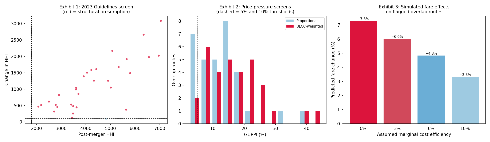

# Merger Competitive Effects Analysis — JetBlue / Spirit

A route-level competitive effects analysis of JetBlue's proposed
acquisition of Spirit Airlines, working the four standard tools of
merger review — concentration screens, market definition, unilateral
effects, and merger simulation — against the case Department of Justice (DOJ) actually brought
and won.



## The business problem

*United States v. JetBlue Airways Corp.* (D. Mass., filed March 2023;
decided January 16, 2024). JetBlue proposed to acquire Spirit for $3.8
billion. DOJ and a coalition of states sued to block it, and Judge
William Young permanently enjoined the deal.

DOJ's theory: Spirit is the largest ultra-low-cost carrier in the U.S.
and disciplines fares wherever it flies. JetBlue planned to reconfigure
Spirit's aircraft and charge JetBlue's higher fares. On concentrated
routes where both carriers competed, eliminating Spirit would raise
prices for exactly the travelers least able to absorb them.

Critically, the case turned on **specific overlapping routes**, not the
national market — two airlines can look small nationally while
dominating dozens of individual city pairs. That is how airline merger
analysis always works, and it is how this analysis is structured.

## The four tools, in order

| Step | Tool | Question it answers |
|---|---|---|
| 1 | **HHI screens** (2023 DOJ/FTC Guidelines) | Where do the parties actually overlap, and which routes trigger the structural presumption? |
| 2 | **Hypothetical monopolist test** (SSNIP / critical loss) | Is a single route a relevant antitrust market, or must substitutes be included? |
| 3 | **Diversion ratios, GUPPI, UPP** | How much of JetBlue's lost traffic is recaptured by Spirit, and what pricing incentive does that create? |
| 4 | **Bertrand-Nash merger simulation** | How much do fares actually rise, and what efficiency credit would offset it? |

## Results

Working the sample panel of 463 routes:

- **Screening** narrows 463 routes to 32 overlap routes, of which 31
  trigger the 2023 Guidelines structural presumption. Mean
  post-merger HHI on flagged routes: 4,247 — deep into "highly
  concentrated" territory.
- **Market definition:** on the most concentrated overlap routes, the
  two parties alone satisfy the hypothetical monopolist test —
  predicted volume loss of 3–8% against a 16.7% critical loss. On
  those routes this is effectively a merger to monopoly.
- **Unilateral effects:** 29 of 32 overlap routes show GUPPI above the
  5% investigation threshold; 20 exceed 10%. Under the ULCC-weighted
  diversion reflecting DOJ's substitution theory, 24 exceed 10%.
- **Simulation:** passenger-weighted average fare increase of **+7.3%**
  on flagged routes with no efficiencies, still **+6.0%** crediting a
  3% marginal cost reduction. A ~15%+ efficiency would be needed to
  fully offset — far above what merging parties typically verify.

## The assumptions


- **Margin (25% assumed).** Airline variable margins aren't observable
  in DB1B. Sensitivity: the predicted fare effect ranges from +4.4% to
  +10.2% across 15–35% margins — the *sign* is robust, the magnitude
  isn't.
- **Logit demand imposes proportional diversion** (the IIA property) —
  which is precisely the assumption DOJ disputed, arguing Spirit's
  price-sensitive customers wouldn't trade up to legacy carriers. The
  simulation is therefore **conservative relative to the government's
  theory**, and the ULCC-weighted diversion is reported alongside it as
  an explicit assumption rather than folded silently into one number.
- **Static analysis** — no entry, capacity response, or the seat
  reconfiguration the court weighed heavily.

## Data

**DOT DB1B** (Airline Origin and Destination Survey) — a free 10%
sample of all domestic tickets, the dataset airline merger economists
have used for decades. `db1b.py` downloads it from BTS and applies the
standard cleaning filters (single-ticket domestic itineraries,
round-trip fares halved, $20–$2,000 fare screens, bulk fares dropped,
non-directional city pairs, 1% minimum carrier share) — each one
documented, because each is contestable.

⚠️ **The shipped `data/route_panel.csv` is SYNTHETIC**, calibrated to
the real JetBlue/Spirit network structure and fare positioning so the
analysis runs without an 800MB download. It is **not real DOT data**.


```bash
python -m mergeranalysis.db1b --build     # downloads 2022 Q1–Q4 DB1B
```

## Run it

```bash
pip install -r requirements.txt
python make_fallback_data.py    # or --build above for real data
python run_analysis.py
```

## References

- 2023 DOJ/FTC Merger Guidelines (Guideline 1; Appendix 2 on market
  definition)
- Farrell & Shapiro (2010), "Antitrust Evaluation of Horizontal
  Mergers: An Economic Alternative to Market Definition"
- Werden & Froeb, calibrated-demand merger simulation
- *United States v. JetBlue Airways Corp.*, No. 1:23-cv-10511
  (D. Mass. Jan. 16, 2024)
